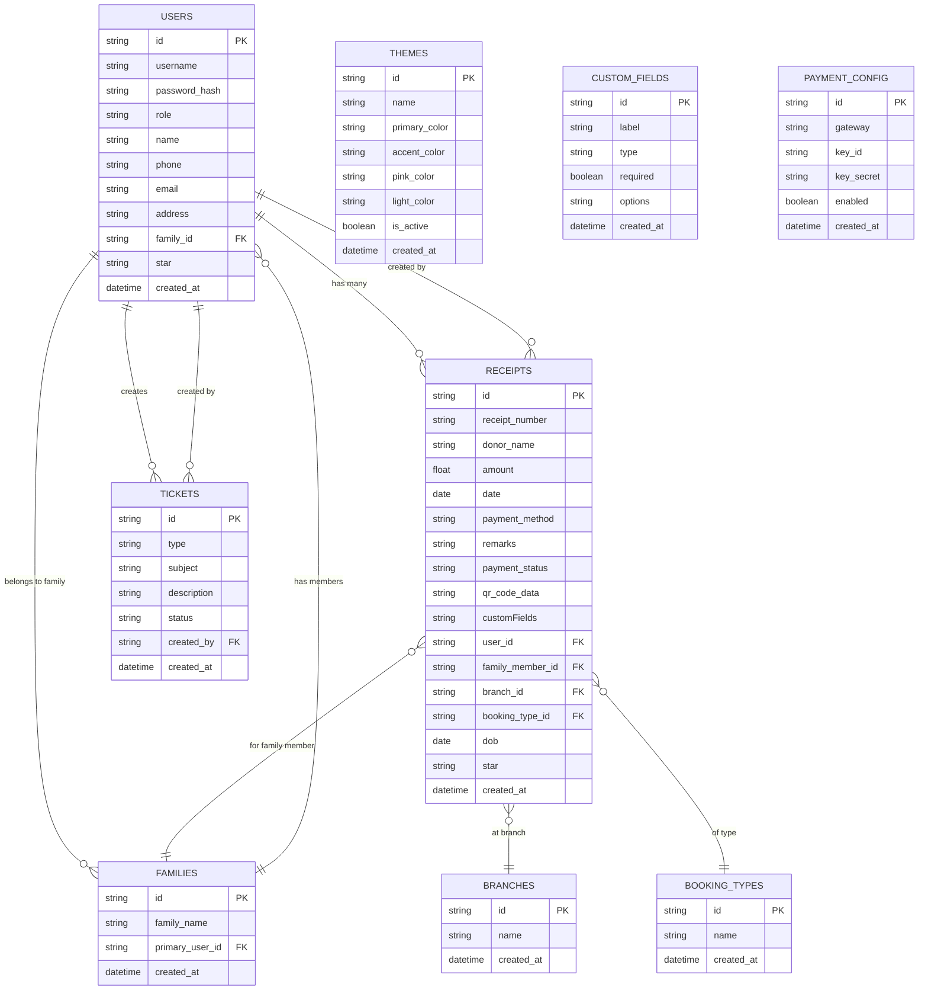

# Donation Management System

## Overview
A full-featured, production-ready donation and receipt management system for Santhigiri Ashram. Built with a React frontend and Node.js/Express/MySQL backend, supporting multi-user roles, global theming, custom fields, ticket/support system, Razorpay payment integration, and backup/restore.

---

## Features
- **Multi-user roles:** Admin, Staff, Public
- **Receipts:** CRUD, auto-numbering, QR code, bulk delete
- **Donations:** Razorpay payment integration
- **Theming:** Global, admin-controlled, theme manager
- **Custom Fields:** Dynamic fields for receipts
- **Tickets:** Support (public), staff tickets
- **User Management:** Admin can manage users and roles
- **Reports & Analytics:** Filters, summary cards, charts
- **Backup/Restore:** Full data export/import
- **Security:** JWT auth, role-based access, best-practice headers
- **Responsive UI:** Mobile, tablet, desktop

---

## Architecture

```mermaid
flowchart LR
    %% ===============================
    %% CLIENT (Frontend)
    %% ===============================
    subgraph CLIENT["Frontend (React)"]
        direction TB
        UA[User Admin]
        UB[User Staff]
        UC[User Public]

        A1[Login / Register (JWT)]
        A2[Receipts CRUD]
        A3[Reports & Charts]
        A4[Theme Switcher]
        A5[User Management (Admin)]
        A6[Custom Fields (Admin)]
        A7[Settings / Backup & Restore (Admin)]
        A8[Support Tickets (Public)]
        A9[Staff Tickets]
        A10[Pushpanjali Donation (Public)]
        A11[Razorpay Checkout]
        A12[QR Code Display]
    end

    %% ===============================
    %% BACKEND (Node.js/Express)
    %% ===============================
    subgraph BACKEND["Backend (Node.js + Express)"]
        direction TB
        B1[Auth Controller (JWT + Roles)]
        B2[Receipts Controller]
        B3[Reports Controller]
        B4[Theme Controller]
        B5[User Controller]
        B6[Custom Fields Controller]
        B7[Settings Controller]
        B8[Tickets Controller]
        B9[Payment Controller (Razorpay SDK)]
        B10[QR Code Generator]
        B11[Backup & Restore Handler]
        B12[Role-based Middleware]
    end

    %% ===============================
    %% DATABASE
    %% ===============================
    subgraph DB["MySQL Database"]
        direction TB
        D1[(users)]
        D2[(receipts)]
        D3[(themes)]
        D4[(custom_fields)]
        D5[(tickets)]
        D6[(payment_config)]
        D7[(backup_files)]
    end

    %% ===============================
    %% PAYMENT
    %% ===============================
    subgraph PAYMENT["Razorpay Gateway"]
        P1[Razorpay API]
    end

    %% ===============================
    %% CLIENT -> BACKEND
    %% ===============================
    UA --> A1
    UB --> A1
    UC --> A1
    A1 --> B1 --> D1

    UA --> A2
    UB --> A2
    A2 --> B2 --> D2
    B2 --> B10 --> A12

    UA --> A3
    UB --> A3
    A3 --> B3 --> D2

    UA --> A4
    A4 --> B4 --> D3

    UA --> A5 --> B5 --> D1
    UA --> A6 --> B6 --> D4
    UA --> A7 --> B11 --> D7

    UC --> A8 --> B8 --> D5
    UB --> A9 --> B8

    UC --> A10 --> A11 --> P1
    A10 --> B9 --> P1
    B9 --> D2

    %% Role Middleware
    A1 --> B12
    A2 --> B12
    A3 --> B12
    A4 --> B12
    A5 --> B12
    A6 --> B12
    A7 --> B12
    A8 --> B12
    A9 --> B12
    A10 --> B12

```

---

## Upcoming Features (Unified Booking/Receipts, Family, Branch, Booking Type)

- **Unified Booking/Receipts:** Online (booking) and offline (receipts) will use the same form and data structure, with payment method as a field.
- **Family Member Management:**
  - Users can add family members (name, star, etc.) during registration or profile update.
  - Family members are linked to the main user and selectable in booking/receipt forms.
  - Staff can fetch user/family details for offline receipts.
  - When registering, users can link to an existing family.
- **Branch Field:**
  - Branch is a dropdown in booking/receipt forms.
  - Branches are managed by admin in the admin panel.
- **Type of Booking Field:**
  - Type of Booking is a dropdown in booking/receipt forms.
  - Booking types are managed by admin in the admin panel.

### Updated Database Structure



---

## Setup & Installation

1. **Clone the repo:**
   ```sh
   git clone <repo-url>
   cd donation-management-ts
   ```
2. **Install dependencies:**
   ```sh
   npm install
   cd backend && npm install
   ```
3. **Configure environment:**
   - Create `.env` files in both root and backend with DB, JWT, and Razorpay keys.
   - In frontend `.env`:
     ```
     REACT_APP_API_BASE_URL=http://localhost:4000
     GENERATE_SOURCEMAP=false
     ```
4. **Setup MySQL database:**
   - Import provided SQL schema.
   - Update DB credentials in backend `.env`.
5. **Run backend:**
   ```sh
   cd backend
   node server.js
   ```
6. **Run frontend:**
   ```sh
   npm start
   ```

---

## Usage
- **Admin:** Full access to all features, user/theme/payment config, backup/restore.
- **Staff:** Access to receipts, tickets, reports.
- **Public:** Can register, login, donate, and raise support tickets.
- **All actions are role-protected and require JWT authentication.**

---

## Security
- JWT-based authentication, role-based access control
- Helmet for HTTP security headers
- Source maps disabled in production
- No secrets in frontend
- CORS, CSP, and best-practice headers enabled
- Regular `npm audit` and dependency updates recommended

---

## Contribution
- Fork the repo, create a branch, submit a pull request.
- Please follow code style and add tests for new features.

---

## License
MIT
