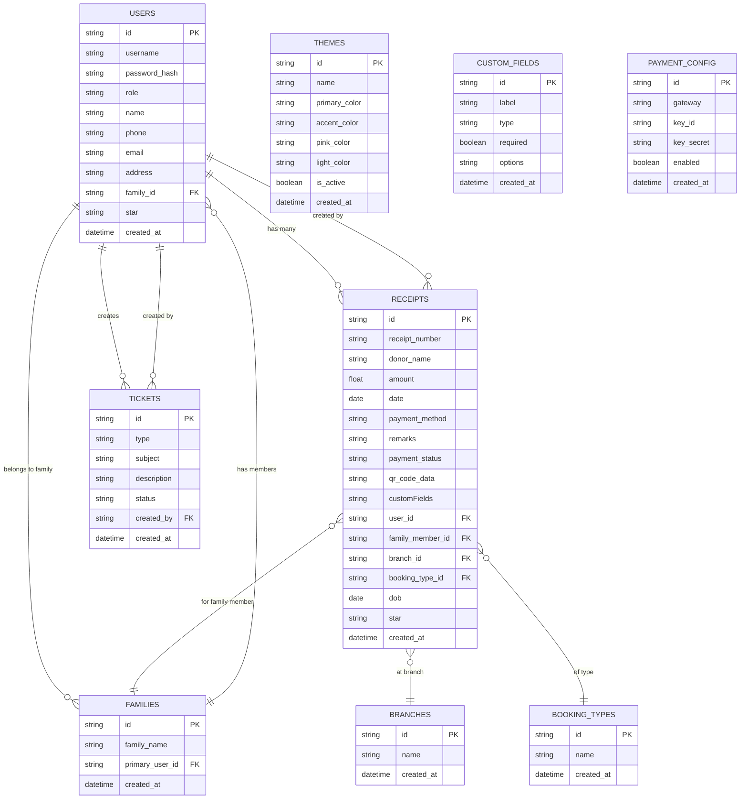

# Donation Management System

## Overview
A full-featured, production-ready donation and receipt management system for Santhigiri Ashram. Built with a React frontend and Node.js/Express/MySQL backend, supporting multi-user roles, global theming, custom fields, ticket/support system, Razorpay payment integration, and backup/restore.

---

## Features
- **Multi-user roles:** Admin, Staff, Public
- **Receipts:** CRUD, auto-numbering, QR code, bulk delete
- **Donations:** Razorpay payment integration
- **Theming:** Global, admin-controlled, theme manager
- **Custom Fields:** Dynamic fields for receipts
- **Tickets:** Support (public), staff tickets
- **User Management:** Admin can manage users and roles
- **Reports & Analytics:** Filters, summary cards, charts
- **Backup/Restore:** Full data export/import
- **Security:** JWT auth, role-based access, best-practice headers
- **Responsive UI:** Mobile, tablet, desktop

---

## Architecture

```mermaid
graph TD
    %% Define Subgraphs for clear separation of layers
    subgraph S_CLIENT["Client-Side Application (React Frontend)"]
        direction LR
        U_ADMIN[Admin User]
        U_STAFF[Staff User]
        U_PUBLIC[Public User]

        %% Changed node shapes to standard brackets for compatibility
        A_AUTH[Login / Register (JWT)]
        A_CRUD[Receipts: CRUD]
        A_REPORTS[Reporting & Analytics]
        A_THEME[Theme Switcher]
        A_USER_MGMT[User Management (Admin)]
        A_CUSTOM_FIELDS[Custom Fields Config]
        A_SYS_CONFIG[System Settings & Backup/Restore]
        A_TICKET_PUBLIC[Support Ticket Submission]
        A_TICKET_STAFF[Staff Ticket Management]
        A_PAYMENT_FORM[Donation / Payment Form]
        A_CHECKOUT[Razorpay Checkout]
        A_QR_DISPLAY[Display QR Code]

        %% User interaction flows
        U_ADMIN --> A_AUTH
        U_STAFF --> A_AUTH
        U_PUBLIC --> A_AUTH

        U_ADMIN --> A_CRUD
        U_STAFF --> A_CRUD
        U_ADMIN --> A_REPORTS
        U_STAFF --> A_REPORTS
        U_ADMIN --> A_THEME
        U_ADMIN --> A_USER_MGMT
        U_ADMIN --> A_CUSTOM_FIELDS
        U_ADMIN --> A_SYS_CONFIG
        U_PUBLIC --> A_TICKET_PUBLIC
        U_STAFF --> A_TICKET_STAFF
        U_PUBLIC --> A_PAYMENT_FORM
        A_PAYMENT_FORM --> A_CHECKOUT
    end

    ---

    subgraph S_BACKEND["Server-Side API (Node.js/Express)"]
        B_AUTH[Auth Controller: JWT Roles]
        B_RECEIPTS[Receipts Controller]
        B_REPORTS[Reports Controller]
        B_THEME[Theme Controller]
        B_USER_MGMT[User Controller]
        B_CUSTOM_FIELDS[Custom Fields Controller]
        B_SYS_CONFIG[Settings / Backup Handler]
        B_TICKETS[Tickets Controller]
        B_PAYMENT[Payment Controller: Razorpay SDK]
        B_QR_GEN[QR Code Generator]
        B_MIDDLEWARE[Role-based Authorization Middleware]

        %% Client to Backend (API) flows
        A_AUTH --> B_AUTH
        A_CRUD --> B_MIDDLEWARE
        A_REPORTS --> B_MIDDLEWARE
        A_THEME --> B_MIDDLEWARE
        A_USER_MGMT --> B_MIDDLEWARE
        A_CUSTOM_FIELDS --> B_MIDDLEWARE
        A_SYS_CONFIG --> B_MIDDLEWARE
        A_TICKET_PUBLIC --> B_MIDDLEWARE
        A_TICKET_STAFF --> B_MIDDLEWARE
        A_PAYMENT_FORM --> B_MIDDLEWARE

        B_MIDDLEWARE --> B_RECEIPTS
        B_MIDDLEWARE --> B_REPORTS
        B_MIDDLEWARE --> B_THEME
        B_MIDDLEWARE --> B_USER_MGMT
        B_MIDDLEWARE --> B_CUSTOM_FIELDS
        B_MIDDLEWARE --> B_SYS_CONFIG
        B_MIDDLEWARE --> B_TICKETS
        B_MIDDLEWARE --> B_PAYMENT
    end

    ---

    subgraph S_DB["Data Layer (MySQL Database)"]
        %% Database nodes use the cylinder shape for visual representation
        D_USERS[(users)]
        D_RECEIPTS[(receipts)]
        D_THEMES[(themes / config)]
        D_CUSTOM_FIELDS[(custom_fields definition)]
        D_TICKETS[(support_tickets)]
        D_CONFIG[(system_config / payments)]
        D_BACKUP[(backup_files_storage)]
    end

    ---

    subgraph S_EXTERNAL["External Service"]
        P_RAZORPAY[Razorpay API Gateway]
    end

    %% Backend to Data Layer flows
    B_AUTH --> D_USERS
    B_USER_MGMT --> D_USERS
    B_RECEIPTS --> D_RECEIPTS
    B_RECEIPTS --> B_QR_GEN
    B_QR_GEN --> A_QR_DISPLAY
    B_REPORTS --> D_RECEIPTS
    B_THEME --> D_THEMES
    B_CUSTOM_FIELDS --> D_CUSTOM_FIELDS
    B_TICKETS --> D_TICKETS
    B_PAYMENT --> D_RECEIPTS
    B_PAYMENT --> D_CONFIG

    B_SYS_CONFIG -- Backup / Restore --> D_BACKUP

    %% Payment Integration flow
    A_CHECKOUT --> P_RAZORPAY
    P_RAZORPAY -- Webhook / Success --> B_PAYMENT
```

---

## Upcoming Features (Unified Booking/Receipts, Family, Branch, Booking Type)

- **Unified Booking/Receipts:** Online (booking) and offline (receipts) will use the same form and data structure, with payment method as a field.
- **Family Member Management:**
  - Users can add family members (name, star, etc.) during registration or profile update.
  - Family members are linked to the main user and selectable in booking/receipt forms.
  - Staff can fetch user/family details for offline receipts.
  - When registering, users can link to an existing family.
- **Branch Field:**
  - Branch is a dropdown in booking/receipt forms.
  - Branches are managed by admin in the admin panel.
- **Type of Booking Field:**
  - Type of Booking is a dropdown in booking/receipt forms.
  - Booking types are managed by admin in the admin panel.

### Updated Database Structure



---

## Setup & Installation

1. **Clone the repo:**
   ```sh
   git clone <repo-url>
   cd donation-management-ts
   ```
2. **Install dependencies:**
   ```sh
   npm install
   cd backend && npm install
   ```
3. **Configure environment:**
   - Create `.env` files in both root and backend with DB, JWT, and Razorpay keys.
   - In frontend `.env`:
     ```
     REACT_APP_API_BASE_URL=http://localhost:4000
     GENERATE_SOURCEMAP=false
     ```
4. **Setup MySQL database:**
   - Import provided SQL schema.
   - Update DB credentials in backend `.env`.
5. **Run backend:**
   ```sh
   cd backend
   node server.js
   ```
6. **Run frontend:**
   ```sh
   npm start
   ```

---

## Usage
- **Admin:** Full access to all features, user/theme/payment config, backup/restore.
- **Staff:** Access to receipts, tickets, reports.
- **Public:** Can register, login, donate, and raise support tickets.
- **All actions are role-protected and require JWT authentication.**

---

## Security
- JWT-based authentication, role-based access control
- Helmet for HTTP security headers
- Source maps disabled in production
- No secrets in frontend
- CORS, CSP, and best-practice headers enabled
- Regular `npm audit` and dependency updates recommended

---

## Contribution
- Fork the repo, create a branch, submit a pull request.
- Please follow code style and add tests for new features.

---

## License
MIT
