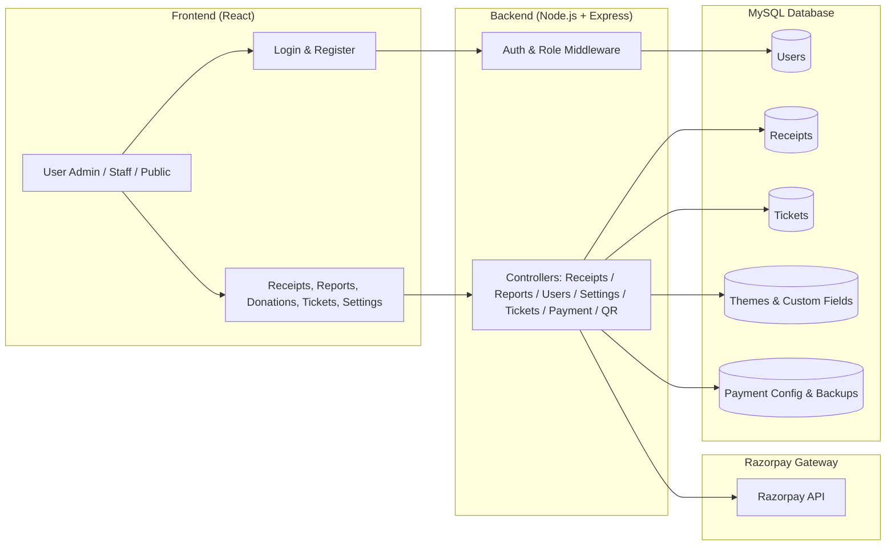
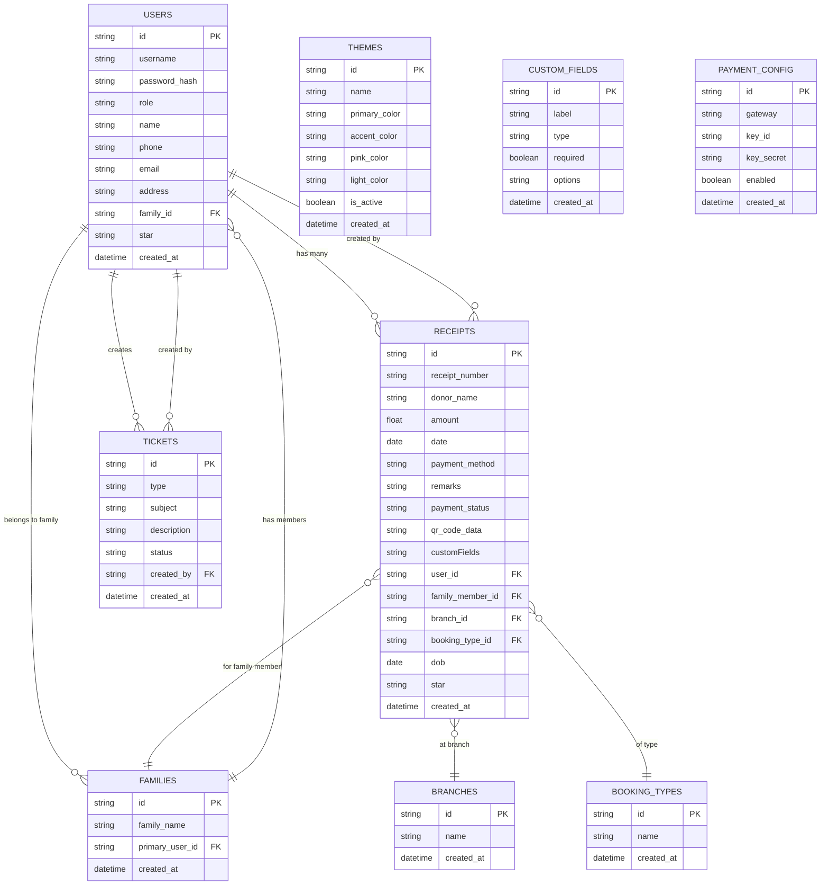

# Donation Management System

## Overview
A full-featured, production-ready donation and receipt management system for Santhigiri Ashram. Built with a React frontend and Node.js/Express/MySQL backend, supporting multi-user roles, global theming, custom fields, ticket/support system, Razorpay payment integration, and backup/restore.

---

## Features
- **Multi-user roles:** Admin, Staff, Public
- **Receipts:** CRUD, auto-numbering, QR code, bulk delete
- **Donations:** Razorpay payment integration
- **Theming:** Global, admin-controlled, theme manager
- **Custom Fields:** Dynamic fields for receipts
- **Tickets:** Support (public), staff tickets
- **User Management:** Admin can manage users and roles
- **Reports & Analytics:** Filters, summary cards, charts
- **Backup/Restore:** Full data export/import
- **Security:** JWT auth, role-based access, best-practice headers
- **Responsive UI:** Mobile, tablet, desktop

---

## Architecture



---

## Upcoming Features (Unified Booking/Receipts, Family, Branch, Booking Type)

- **Unified Booking/Receipts:** Online (booking) and offline (receipts) will use the same form and data structure, with payment method as a field.
- **Family Member Management:**
  - Users can add family members (name, star, etc.) during registration or profile update.
  - Family members are linked to the main user and selectable in booking/receipt forms.
  - Staff can fetch user/family details for offline receipts.
  - When registering, users can link to an existing family.
- **Branch Field:**
  - Branch is a dropdown in booking/receipt forms.
  - Branches are managed by admin in the admin panel.
- **Type of Booking Field:**
  - Type of Booking is a dropdown in booking/receipt forms.
  - Booking types are managed by admin in the admin panel.

### Updated Database Structure



---

## Setup & Installation

1. **Clone the repo:**
   ```sh
   git clone <repo-url>
   cd donation-management-ts
   ```
2. **Install dependencies:**
   ```sh
   npm install
   cd backend && npm install
   ```
3. **Configure environment:**
   - Create `.env` files in both root and backend with DB, JWT, and Razorpay keys.
   - In frontend `.env`:
     ```
     REACT_APP_API_BASE_URL=http://localhost:4000
     GENERATE_SOURCEMAP=false
     ```
4. **Setup MySQL database:**
   - Import provided SQL schema.
   - Update DB credentials in backend `.env`.
5. **Run backend:**
   ```sh
   cd backend
   node server.js
   ```
6. **Run frontend:**
   ```sh
   npm start
   ```

---

## Usage
- **Admin:** Full access to all features, user/theme/payment config, backup/restore.
- **Staff:** Access to receipts, tickets, reports.
- **Public:** Can register, login, donate, and raise support tickets.
- **All actions are role-protected and require JWT authentication.**

---

## Security
- JWT-based authentication, role-based access control
- Helmet for HTTP security headers
- Source maps disabled in production
- No secrets in frontend
- CORS, CSP, and best-practice headers enabled
- Regular `npm audit` and dependency updates recommended

---

## Contribution
- Fork the repo, create a branch, submit a pull request.
- Please follow code style and add tests for new features.

---

## License
MIT
